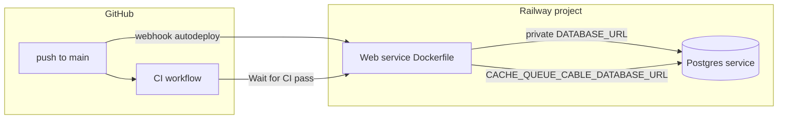

# Railway integration and deploy plan

**Stored at:** `context/changes/deployment-plan/deployment-plan.md`  
**Source of truth:** [`context/foundation/infrastructure.md`](../../foundation/infrastructure.md) (Railway, Dockerfile builder, four Postgres DBs, risk register).

**Deploy model (target):** Railway **GitHub autodeploy** on `main` — **not** a `railway up` GitHub Actions workflow. Existing [`.github/workflows/ci.yml`](../../.github/workflows/ci.yml) stays for quality gates only; enable **Wait for CI** so deploy runs only after CI passes ([Railway docs](https://docs.railway.com/deployments/github-autodeploys)).

**Live today (Phases 0–3):** Project `all-aboard`, services `Postgres` + `web`, production URL `https://web-production-8431bc.up.railway.app` (`/up` → 200; `/` → 404 until a `root` route exists). First deploy via `railway up`; GitHub source **not** connected yet (Phase 4). `db:prepare` runs in both `railway.toml` `preDeployCommand` and `bin/docker-entrypoint` — optional follow-up to drop one.

---

## Architecture



**What stays external**

| Integration | Role | Notes |
|-------------|------|--------|
| **GitHub ↔ Railway App** | Autodeploy webhooks | Contributor access + Railway GitHub App install required |
| **Railway Postgres** | Primary + Solid* DBs | `DATABASE_URL` via `${{Postgres.DATABASE_URL}}` — not hardcoded `postgres.railway.internal` |
| **GitHub Actions** | Lint/security only | Already triggers on `push: main`; pairs with Wait for CI |
| **Railway CLI** (optional) | First deploy, `railway connect`, logs | Local `railway run` cannot reach internal Postgres |
| **Railway MCP** (optional) | Agent ops | `railway mcp install` — post-MVP |

**Out of scope for this change:** GHA deploy workflow, Fly.io, Redis service, staging environment (optional Phase 7), PITR/HA (pre-launch checklist only).

---

## Repo changes (implementation phase)

Minimal, focused diffs:

1. **Add [`railway.toml`](../railway.toml)** (or `railway.json` — pick one; `railway.toml` matches infrastructure doc):

```toml
[build]
builder = "DOCKERFILE"
dockerfilePath = "Dockerfile"

[deploy]
preDeployCommand = "bin/rails db:prepare"
healthcheckPath = "/up"
healthcheckTimeout = 300
restartPolicyType = "ON_FAILURE"
```

- **`preDeployCommand`:** Runs migrations/DB create **before** the new container goes live — mitigates [`bin/docker-entrypoint`](../bin/docker-entrypoint) blocking server boot on slow/failed `db:prepare` ([risk in infrastructure.md](foundation/infrastructure.md)).
- **Optional follow-up:** Remove `db:prepare` from entrypoint once pre-deploy is proven stable (avoid double-run).

2. **Railway service variables** (dashboard Raw Editor — not committed):

| Variable | Value |
|----------|--------|
| `RAILS_ENV` | `production` |
| `RAILS_MASTER_KEY` | From local `config/master.key` |
| `SECRET_KEY_BASE` | `bin/rails secret` (if not using credentials-only path) |
| `DATABASE_URL` | `${{Postgres.DATABASE_URL}}` |
| `CACHE_DATABASE_URL` | Same URL as primary, path/db `all_aboard_production_cache` |
| `QUEUE_DATABASE_URL` | `..._queue` |
| `CABLE_DATABASE_URL` | `..._cable` |
| `HTTP_PORT` | Set in `bin/docker-entrypoint` from runtime `PORT` — do **not** use `${{PORT}}` in Railway variables (resolves empty) |
| `RAILWAY_PUBLIC_DOMAIN` | Set after **Generate Domain** (for mailer/URL helpers later) |

Rails merges `DATABASE_URL` and `CACHE_DATABASE_URL` / `QUEUE_DATABASE_URL` / `CABLE_DATABASE_URL` into [`config/database.yml`](../config/database.yml) production connections per [Rails multi-DB env docs](https://guides.rubyonrails.org/active_record_multiple_databases.html).

3. **Production app config** — **done** in repo:

- [`config/environments/production.rb`](../config/environments/production.rb): `assume_ssl` / `force_ssl`, mailer host from `ENV["RAILWAY_PUBLIC_DOMAIN"]`.
- [`config/cable.yml`](../config/cable.yml): production `adapter: solid_cable` (no Redis). Verified: `RAILS_ENV=production bin/rails runner 'puts :ok'`.

4. **Docs alignment** — **done:** [`context/foundation/tech-stack.md`](../../foundation/tech-stack.md) `ci_default_flow` and deploy prose; [`context/foundation/infrastructure.md`](../../foundation/infrastructure.md) current-deployment section aligned with this plan.

5. **Optional:** [`.env.example`](../.env.example) listing Railway variable names (no secrets).

**Do not add:** `.github/workflows/deploy.yml`, `RAILWAY_TOKEN` in GitHub Secrets for deploy.

---

## Phased rollout with checkpoints

Mark `[x]` as you complete each item.

### Phase 0 — Prerequisites

- [x] **P0.1** Railway account + Hobby/billing understood (~$10–15/mo per infrastructure estimate)
- [x] **P0.2** Install CLI: `bash <(curl -fsSL https://railway.com/install.sh)` → `railway --version`
- [x] **P0.3** `railway login` (browser OAuth)
- [x] **P0.4** GitHub repo pushed; you have **contributor** access (autodeploy requirement)
- [x] **P0.5** Local: `config/master.key` present; `bin/ci` green locally
- [x] **P0.6** Optional local `psql` client installed (`psql --version`) — needed for **P1.5** `railway connect postgres`, not before Railway is initialized

**Edge — CLI auth fails:** Clear `~/.railway` config, re-login; check corporate proxy.

---

### Phase 1 — Railway project and database

- [x] **P1.1** `railway init` → new project `all-aboard` (or link existing). If the repo is not linked afterward, run `railway link --project all-aboard` (or `--project <id>`) from the repo root — `init` creates the project but a timeout or non-interactive shell may leave the local directory unlinked.
- [x] **P1.2** `railway add --database postgres --json` → **PostgreSQL** service (always pass `--json`; verify with `railway service list --json` before retrying)
- [x] **P1.3** `railway add --service web --json` → empty **Web** service. If the CLI still prompts interactively, choose **Empty Service**, name `web`, then **Esc** at “Enter a variable” — env vars are set in Phase 2, not here.
- [ ] **P1.4** Postgres → **Backups** enabled (MVP posture) — dashboard only
- [x] **P1.5** After P1.1–P1.2: `railway connect postgres` **or** local `psql` via Postgres `DATABASE_PUBLIC_URL` → run SQL from infrastructure.md:

```sql
CREATE DATABASE all_aboard_production_cache;
CREATE DATABASE all_aboard_production_queue;
CREATE DATABASE all_aboard_production_cable;
```

(Primary DB may be Railway default `railway`; `DATABASE_URL` controls Rails primary name.)

- [ ] **P1.6** Set spend limit / usage alerts in project settings — dashboard only

**Edge — init succeeded but CLI not linked:** Run `railway link --project all-aboard`; confirm with `railway status`.

**Edge — cannot create DBs:** Use Railway Data tab / `psql` via connect; confirm role has `CREATEDB`.

**Edge — wrong host in app:** Never paste raw `postgres.railway.internal` into app vars; use `${{Postgres.DATABASE_URL}}` ([Station thread](https://station.railway.com/questions/postgres-connection-problems-dc4617e2)).

---

### Phase 2 — Web service build config

- [x] **P2.1** Commit `railway.toml` (Dockerfile builder — avoids Nixpacks ignoring Thruster image)
- [x] **P2.2** Service **Settings → Build**: confirm Dockerfile path `Dockerfile` (also set in `railway.toml`)
- [x] **P2.3** Service **Settings → Deploy**: health check path `/up`, timeout ≥ 300s (also set in `railway.toml`)
- [x] **P2.4** Variables (Raw Editor): table in “Repo changes” above — or CLI block below
- [x] **P2.5** **Networking → Generate Domain** → copy hostname → set `RAILWAY_PUBLIC_DOMAIN` — `web-production-8431bc.up.railway.app`

**P2.4 + P2.5 CLI** (from repo root, `web` service linked; re-run `railway login` if token expired):

```bash
railway service link web
printf "%s" "$(cat config/master.key)" | railway variable set RAILS_MASTER_KEY --stdin --service web
railway variable set RAILS_ENV=production --service web
railway variable set DATABASE_URL='${{Postgres.DATABASE_URL}}' --service web
railway variable set CACHE_DATABASE_URL='postgresql://${{Postgres.PGUSER}}:${{Postgres.PGPASSWORD}}@${{Postgres.RAILWAY_PRIVATE_DOMAIN}}:${{Postgres.PGPORT}}/all_aboard_production_cache' --service web
railway variable set QUEUE_DATABASE_URL='postgresql://${{Postgres.PGUSER}}:${{Postgres.PGPASSWORD}}@${{Postgres.RAILWAY_PRIVATE_DOMAIN}}:${{Postgres.PGPORT}}/all_aboard_production_queue' --service web
railway variable set CABLE_DATABASE_URL='postgresql://${{Postgres.PGUSER}}:${{Postgres.PGPASSWORD}}@${{Postgres.RAILWAY_PRIVATE_DOMAIN}}:${{Postgres.PGPORT}}/all_aboard_production_cable' --service web
# Do not set HTTP_PORT=${{PORT}} — PORT is runtime-only. bin/docker-entrypoint sets HTTP_PORT from PORT.
railway domain --service web --json   # copy hostname from output
railway variable set RAILWAY_PUBLIC_DOMAIN='<hostname-from-domain-command>' --service web
```

Repo-side Phase 2 fixes (done): `config/cable.yml` → `solid_cable`; `config/environments/production.rb` → SSL + mailer host from `RAILWAY_PUBLIC_DOMAIN`.

**Edge — build uses Nixpacks:** Force `builder = "DOCKERFILE"` in `railway.toml` and redeploy.

**Edge — health check fails but logs show Puma on 3000 / Thruster on :80:** Railway routes to runtime `PORT`; Thruster must listen there. `${{PORT}}` in service variables resolves empty — use `bin/docker-entrypoint` to `export HTTP_PORT="${HTTP_PORT:-$PORT}"` instead.

**Edge — Thruster/TLS:** Do not set `TLS_DOMAIN` on Railway (TLS terminates at Railway edge).

---

### Phase 3 — First production deploy (manual)

- [x] **P3.1** First deploy via CLI **or** dashboard: `railway up --ci` linked to web service (validates build before GitHub wiring)
- [x] **P3.2** Watch **build logs** then **deploy logs** for `db:prepare` / migration output
- [x] **P3.3** Hit `https://<domain>/up` → expect **200** — `https://web-production-8431bc.up.railway.app/up`
- [x] **P3.4** Hit root (may 404 until routes exist — OK for infra validation). Rails dev-only welcome at `/` is not mounted in production.
- [x] **P3.5** `railway logs -n 200` — no recurring DB connection errors

**Edge — deploy stuck / timeout on `db:prepare`:**

1. Confirm Postgres service **Online** in same project/environment.
2. Redeploy once (transient private-network race — [Station reports](https://station.railway.com/questions/railway-internal-postgre-sql-networking-0c663533)).
3. If repeated: rely on `preDeployCommand` only; temporarily comment out entrypoint `db:prepare` block and redeploy.
4. Nonsense env var change → redeploy (community workaround for stuck networking).
5. Do **not** run prod migrations from laptop via `railway run` (internal DNS unavailable locally).

**Edge — `secret_key_base` / credentials error:** Set `RAILS_MASTER_KEY` from `config/master.key`.

**Edge — asset errors:** Dockerfile already runs `assets:precompile` with dummy key — if Tailwind added later, keep precompile in Dockerfile (Railway Rails guide).

---

### Phase 4 — GitHub autodeploy on `main`

- [ ] **P4.1** Web service → **Connect GitHub repo** (`Offmat/10xProject`) — dashboard required; CLI `environment edit` prompts interactively
- [ ] **P4.2** **Trigger branch:** `main`; **Autodeploy:** Enabled
- [ ] **P4.3** **Wait for CI:** Enabled (`source.checkSuites` / “Wait for CI” toggle)
- [ ] **P4.4** **Watch paths:** empty or include `/` (avoid skipping Rails changes)
- [ ] **P4.5** Push empty commit or doc change to `main` → verify deployment **WAITING** → **SUCCESS** after GHA
- [ ] **P4.6** Confirm **no** deploy workflow in GHA — only existing CI jobs

**Dashboard path:** Project `all-aboard` → service `web` → **Settings** → **Source** → Connect `Offmat/10xProject`, branch `main`, enable autodeploy + Wait for CI.

**Edge — autodeploy disabled / greyed out:**

1. Reconnect GitHub; refresh Railway GitHub App repo access.
2. Confirm contributor access on repo.
3. Disconnect/reconnect repo; Cmd+K → Deploy Latest Commit.
4. Check [Railway + GitHub status](https://status.railway.app) for webhook outages.

**Edge — CI passes but deploy SKIPPED:** Failed GHA job on push; or watch paths exclude changed files — click **Show Skipped** in deployment history.

**Edge — CI fails, deploy never runs:** Fix Brakeman/RuboCop/importmap on branch before merge.

---

### Phase 5 — Production hardening (MVP)

- [ ] **P5.1** Document rollback: Dashboard → Deployments → prior success → **Redeploy** (schema does not roll back)
- [ ] **P5.2** Migration policy: backward-compatible migrations only
- [ ] **P5.3** One **backup restore drill** on Postgres (infrastructure MVP checklist)
- [ ] **P5.4** Optional: enable **PITR** before real users
- [x] **P5.5** Update root [`AGENTS.md`](../AGENTS.md) deploy pointer if any new env vars or commands
- [ ] **P5.6** Optional: `railway mcp install` for Cursor

**Edge — bad migration shipped:** Redeploy previous **app** image; restore DB from backup/PITR fork — human-approved ([PITR docs](https://docs.railway.com/volumes/point-in-time-recovery)).

**Edge — spend cap hit:** Services may **stop** — raise cap or reduce resources; check Usage weekly.

---

### Phase 6 — Verification checklist

- [ ] **V1** Autodeploy: merge/push to `main` → new Railway deployment without manual `railway up`
- [ ] **V2** Wait for CI: failed lint on `main` → deploy skipped
- [x] **V3** `/up` returns 200 after deploy — verified via CLI deploy (`web-production-8431bc.up.railway.app/up`)
- [x] **V4** Four DBs exist; `db:prepare` succeeds for primary + cache + queue + cable — verified on deploy (re-run after Phase 4 autodeploy)
- [ ] **V5** `bin/ci` still the local pre-push habit; production secrets not in git

---

### Phase 7 — Optional staging (later)

- [ ] Duplicate **environment** or branch-deploy service `staging` + separate Postgres (isolates migration experiments per infrastructure pre-mortem)

---

## CI vs deploy (explicit split)

| Concern | Owner |
|---------|--------|
| RuboCop, Brakeman, bundler-audit, importmap audit | GitHub Actions [`.github/workflows/ci.yml`](../.github/workflows/ci.yml) |
| Build image, run container, expose URL | Railway |
| Trigger production deploy | Push to `main` → Railway webhook |
| Gate deploy on quality | Railway **Wait for CI** = true |

No `RAILWAY_TOKEN` in GitHub for deploy. Optional future: add RSpec to GHA so Wait for CI also blocks on tests.

---

## Implementation order

1. ~~Add `railway.toml` + production.rb / cable.yml / entrypoint fixes.~~ **Done** (committed).
2. ~~Phases 0–3~~ **Done** via CLI; **Phase 4** next (GitHub source in dashboard).
3. ~~Update `tech-stack.md` and `infrastructure.md`.~~ **Done**.
4. Check off checkpoints in this file as you go — then Phase 5–6 after autodeploy.

---

## Key files reference

| File | Purpose |
|------|---------|
| [`Dockerfile`](../Dockerfile) | Production image, Thruster CMD, asset precompile |
| [`bin/docker-entrypoint`](../bin/docker-entrypoint) | `db:prepare` before server (consider narrowing after preDeploy) |
| [`config/database.yml`](../config/database.yml) | Four production DB connections |
| [`config/puma.rb`](../config/puma.rb) | `PORT` for Puma behind Thruster |
| [`context/foundation/infrastructure.md`](foundation/infrastructure.md) | Risks, SQL, operational story |
